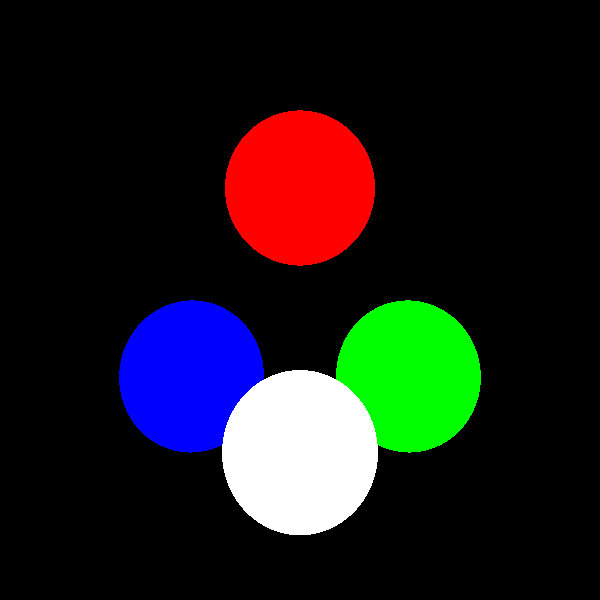

# Overview

simple raytracer written in Haskell

work in progress ... just for fun man ;)

## Progress

### Version 1
Just a very basic renderer just giving the first hit material-color without anything else.
Only objects aviable are spheres.
