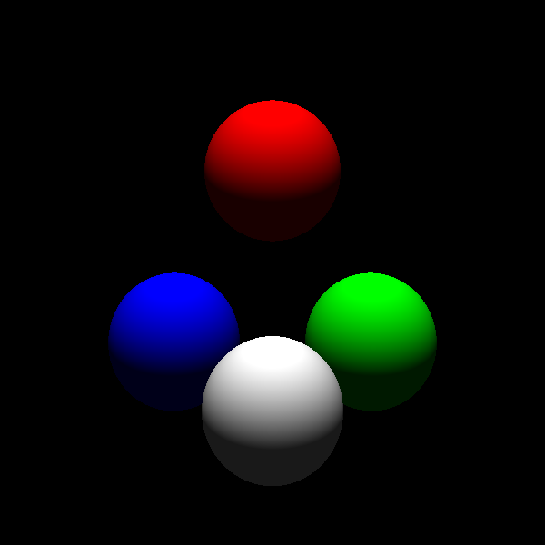

# Overview

simple raytracer written in Haskell

work in progress ... just for fun man ;)

## Progress

### Step 1
Just a very basic renderer just giving the first hit material-color without anything else.
Only objects aviable are spheres.

### Step 2.1
Added basic shading with ambient and directed light

### Step 2.2
Added positional lights that cast shadows
